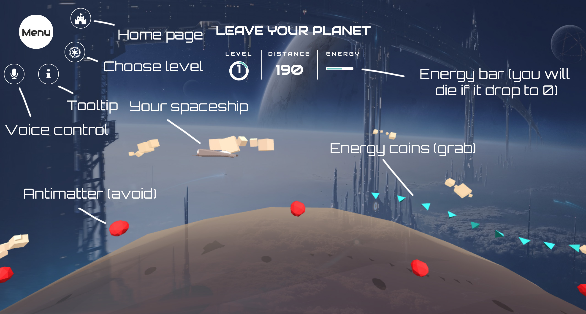
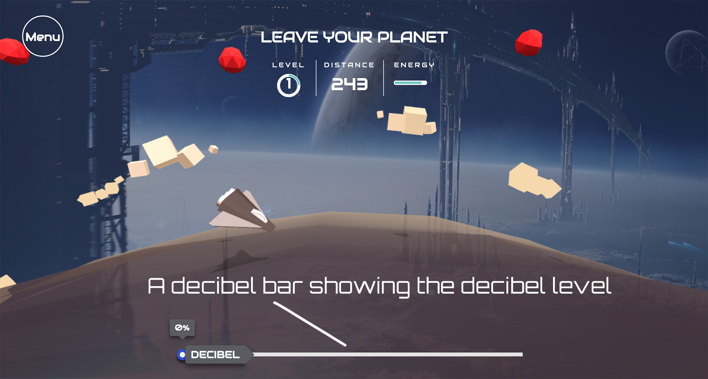
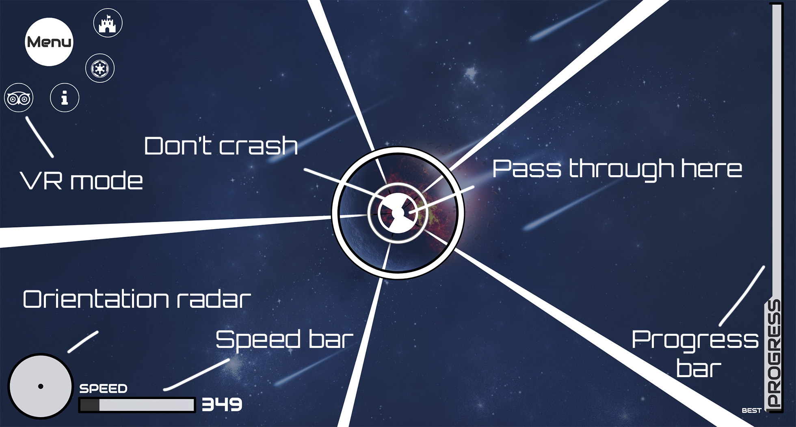

# Galaxy Voyager

It is not easy to be a voyager, but we still want to leave...

&nbsp;

## Play It

https://renovamen.github.io/Galaxy-Voyager/

&nbsp;

## Game

### Voyage #1: Fly

Fly a spaceship to eat energy coins (blue) and avoid crashing antimatter (red) (Based on [TheAviator](https://github.com/yakudoo/TheAviator)). Voice control is supported, the flying height of the plane will depend on your decibel level after clicking the "microphone" button (Obviously, this idea is inspired by 休むな！８分音符ちゃん).

[Play it](https://renovamen.github.io/Galaxy-Voyager/views/level1.html)

Screenshot:





&nbsp;

### Voyage #2: Wormhole

Fly a spaceship to past a sequence of rotating barriers and avoid crashing (Based on [missile-game](https://github.com/bwhmather/missile-game)). VR is supported if you have a Google Cardboard or other similar devices. According to my test (iPhone 7 & Essential Phone), VR experience on Firefox is the best.

Play it: [Normal](https://renovamen.github.io/Galaxy-Voyager/views/level2.html), [VR](https://renovamen.github.io/Galaxy-Voyager/views/level2-vr.html)

Screenshot:

- Normal

  

- VR

  

&nbsp;

## Run Locally

A local server should be built before running this game locally. There are several ways to build a local server, for example:

```powershell
cd Galaxy-Voyager
npm install http-server
http-server
```

Then, open  http://127.0.0.1:8080.

&nbsp;

## Dependencies

- [three.js](https://github.com/mrdoob/three.js/): JavaScript 3D library, using for building character and environment in *Voyage #1: Fly*.
  - [MTLLoader.js](https://github.com/mrdoob/three.js/blob/master/examples/js/loaders/MTLLoader.js): Load spaceship model (mtl).
  - [OBJLoader.js](https://github.com/mrdoob/three.js/blob/master/src/loaders/ObjectLoader.js): Load spaceship model (obj).
- [TweenMax](https://www.tweenmax.com.cn/): JavaScript animation library, using for making animation of the plane, energy coins and antimatter in *Voyage #1: Fly*.
- [Path.js & 2D.js](http://www.kevlindev.com/gui/shapes/path/index.htm): SVG geometry library, using for building environment in *Voyage #2: Wormhole*.
- [ThreeCSG](https://github.com/chandlerprall/ThreeCSG): CSG plugin for three.js, using for special effects of title in homepage.
- [jBox](https://github.com/StephanWagner/jBox): A jQuery plugin that makes it easy to create customizable tooltips and more.
- [Font Awesome](https://github.com/FortAwesome/Font-Awesome): A icon set.
- [jQuery](https://github.com/jquery/jquery): A JavaScript library.
- [Bootstrap](https://github.com/twbs/bootstrap): A front-end component library.